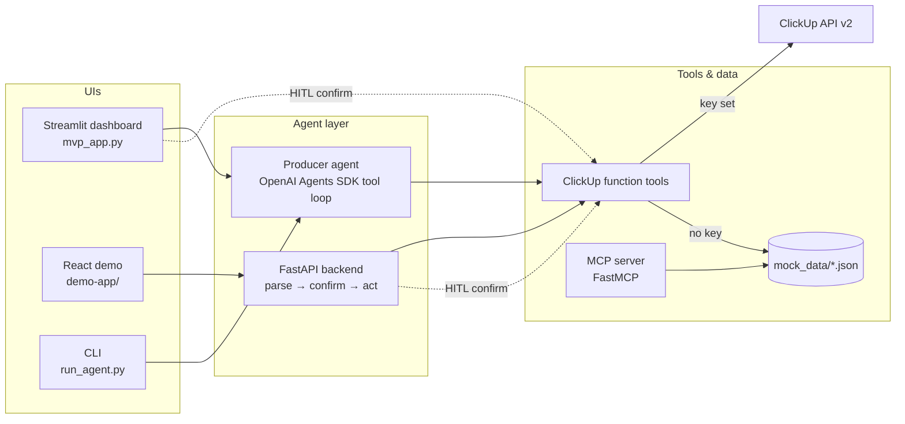

# Agentic Workflow Automation

Agentic workflow automation for a video-production pipeline: a role-based agent that turns natural-language requests into ClickUp tasks behind human-in-the-loop gates, plus two demo surfaces (Streamlit and React) and an MCP server that serves the pipeline's domain data to any MCP client.

The project was built as a working proposal-and-MVP for a YouTube growth agency that runs client work in "pods" (small cross-functional teams). It models the agency's real production pipeline, role time allocations, tool stack, and a 16-item AI tool wish list, then implements the highest-priority wish-list item end to end — natural-language task creation in ClickUp (tool ID **PR-4**) — with the other seven high-priority tools presented as simulated walkthroughs on the same data. Everything runs in a keyless demo mode by default; adding API keys switches individual integrations to live calls.

## Architecture at a glance

- **Orchestration pattern: single-agent tool loop with human-in-the-loop gates.** One role agent (the Producer agent, built on the [OpenAI Agents SDK](https://openai.github.io/openai-agents-python/)) loops over four ClickUp function tools until it produces a final answer (`role_agents/producer_agent.py`, `connectors/clickup_tools.py`). The React demo's backend implements the same capability as a deterministic three-step pipeline: **parse → human confirm → act** (`demo-app/backend/main.py`). There is no multi-agent supervisor or handoff in the code; additional role agents are planned in `AGENTIC_PLAN.md` but not implemented.
- **Models.** The Producer agent uses the Agents SDK's default model; the React demo backend calls `gpt-4o-mini` for prompt parsing, with a rule-based regex parser as a no-key fallback (`demo-app/backend/agent_llm.py`).
- **Memory / session state.** Stateless per run. The Streamlit app holds pending task proposals in `st.session_state` so a human can confirm or cancel across reruns; the React app keeps UI state client-side. There is no database or persistent memory store.
- **Retrieval.** None (no vector store). Domain context is structured JSON under `mock_data/`, reachable three ways: loaded directly by the UIs, exposed as agent function tools, and served as MCP tools/resources by `mcp_servers/agency_mock_server.py` (FastMCP, 6 tools + 7 `agency://` resources).
- **Live integrations.** ClickUp REST API v2 (task create/list/update — implemented and key-gated), Slack Web API (channel list / post message — implemented and key-gated), Frame.io and Notion (status checks only; no client code yet).



Deeper documentation:

- [docs/ARCHITECTURE.md](docs/ARCHITECTURE.md) — component map, data flow, orchestration and state analysis, design trade-offs
- [docs/EVALUATION.md](docs/EVALUATION.md) — what is (and is not) tested, edge cases handled in code, proposed evaluation harness
- [docs/HARDENING.md](docs/HARDENING.md) — current security posture and a staged path to production

## Quickstart

### 1. Streamlit dashboard + Producer agent (Python)

Requires Python 3.10+ for the OpenAI Agents SDK (the dashboard itself runs on 3.9 with mock results).

```bash
git clone <this-repo> && cd agentic-workflow-automation
python3 -m venv .venv && source .venv/bin/activate
pip install -r requirements.txt
streamlit run mvp_app.py
```

Expected output: Streamlit prints a local URL (default `http://localhost:8501`). The app opens on the **Run Demo** page with connection pills showing which integrations are configured; with no `.env`, everything runs on mock data and the PR-4 tab produces a mock task proposal you can confirm or cancel.

Run the Producer agent from the CLI (requires `OPENAI_API_KEY`; ClickUp optional — without it the tools answer from mock data and mark results `(demo mode)`):

```bash
export OPENAI_API_KEY=<your key>
python run_agent.py "Create a task for Mango Pod: longform edit for Client Alpha, due Friday"
```

Expected output: the agent's final reply (e.g. a confirmation naming the created task) followed by a `--- Tool calls ---` listing such as `create_clickup_task: Created task id: demo_task_001 ... (demo mode)`.

### 2. React demo app

```bash
cd demo-app
npm install
npm run dev            # prints ">>> OPEN IN BROWSER: http://localhost:3000 <<<"
```

Optional FastAPI backend for live demo runs and the two-step HITL task-creation flow:

```bash
cd demo-app
pip install -r backend/requirements.txt
npm run backend        # uvicorn on http://localhost:8000
```

`GET http://localhost:8000/health` returns `{"status": "ok", "service": "agency-demo-api", "clickup_configured": false}` until a ClickUp key is set. Railway deployment notes are in `demo-app/RAILWAY.md`.

### 3. Mock-data MCP server

Serves the pipeline, time allocations, pods, tool stack, wish list, and survey summary to any MCP client over stdio (requires Python 3.10+):

```bash
pip install "mcp[cli]"
python mcp_servers/agency_mock_server.py
```

See `mcp_servers/README.md` for wiring it into an agent or an MCP-enabled client.

## Configuration

All configuration is by environment variable, loaded from a `.env` file at the repo root (the Streamlit app and the demo backend both use `python-dotenv`; the backend also checks `demo-app/backend/.env`). Every variable is optional — missing keys degrade to demo mode rather than failing.

| Variable | Used by | Purpose | Where to get it |
|----------|---------|---------|-----------------|
| `OPENAI_API_KEY` | Producer agent, demo backend | Agent runs (Agents SDK) and prompt parsing (`gpt-4o-mini`) | platform.openai.com |
| `CLICKUP_API_KEY` (or `CLICKUP_PERSONAL_TOKEN`) | connectors, demo backend | Live ClickUp task create/list/update | ClickUp → Settings → Apps → API Token (`pk_…`) |
| `CLICKUP_TEAM_ID` | connectors | Target a specific workspace; backend auto-discovers if unset | ClickUp workspace settings |
| `SLACK_BOT_TOKEN` (or `SLACK_TOKEN`) | `connectors/slack_client.py` | List channels, send messages | Slack app bot token (`xoxb-…`) |
| `FRAMEIO_ACCESS_TOKEN` | connection status only | Marks Frame.io "configured" (no client code yet) | Frame.io developer token |
| `NOTION_API_KEY` | connection status only | Marks Notion "configured" (no client code yet) | Notion integration token |
| `PORT` | `demo-app/server.js` | Serve port for the built React app (set by Railway) | — |

## Repository map

| Path | What it is |
|------|------------|
| `mvp_app.py` | Streamlit dashboard: 8 wish-list tool demos (PR-4 live, 7 simulated), time allocations, pipeline, proposal summary |
| `run_agent.py`, `role_agents/`, `connectors/` | Producer agent (Agents SDK), ClickUp/Slack connectors with demo-mode fallback |
| `mcp_servers/` | FastMCP server exposing `mock_data/` as MCP tools and resources |
| `demo-app/` | React 18 + Vite pipeline-browser demo; `backend/` is the FastAPI HITL agent API |
| `mock_data/`, `MCP SYNTHESIZED DATA/` | Domain JSON: pipeline stages, roles, pods, tool stack, wish list; synthetic MCP-style responses |
| `pipeline_demo/`, `proposal_contract/`, `the agency -REFERENCE/` | Engagement artifacts: architecture/proposal PDFs and HTML, source reference documents |
| `AGENTIC_PLAN.md`, `HUMAN_IN_THE_LOOP_GATES.md`, `MCP_SERVERS_AND_DATA.md` | Planning docs: framework choice and batches, HITL gate inventory, data/MCP topology |
